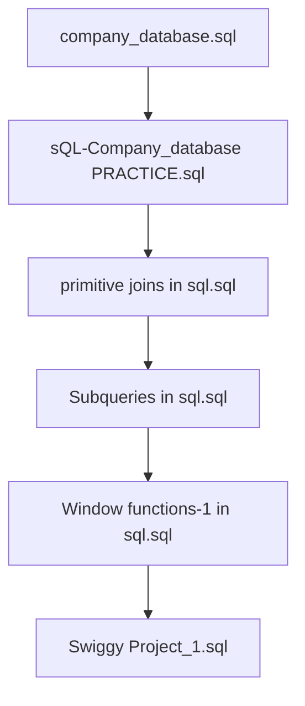

markdown# 📊 SQL Practice & Analytics Portfolio

Welcome to my comprehensive SQL development and practice repository. This project serves as a structured portfolio documenting my journey through relational database management systems (RDBMS). It spans from foundational schema designs and primitive table relationships to complex nested data evaluation and advanced window functions. 

The repository features real-world dataset simulations, including an organizational corporate management system and an e-commerce food delivery platform case study.

---

## 📂 Deep Dive: File Summaries & Analytical Breakdowns

📂 Click to expand / collapse file detailed breakdowns

### 1. `LICENSE`
* **Purpose**: Legal framework for code distribution.
* **Details**: Contains standard open-source licensing terms (e.g., MIT, Apache 2.0, or GPL) that outline permissions, limitations of liability, and conditions under which other developers can copy, modify, or distribute these SQL scripts.

### 2. `company_database.sql`
* **Purpose**: Core enterprise schema architecture definition.
* **Technical Breakdown**:
  * Contains Data Definition Language (DDL) scripts to initialize a multi-table corporate environment.
  * Sets up tables such as `employees`, `departments`, `projects`, `salaries`, and `dependent_info`.
  * Implements database normalization (typically 1NF, 2NF, 3NF) to minimize data redundancy.
  * Establishes entity relationship integrity using strict constraints (`PRIMARY KEY`, `FOREIGN KEY`, `NOT NULL`, `UNIQUE`, and `ON DELETE CASCADE`).

### 3. `sQL-Company_database(PRACTICE).sql`
* **Purpose**: Sandbox environment and scratchpad for testing operations on the company schema.
* **Technical Breakdown**:
  * Focuses on Data Manipulation Language (DML) scripts, including mock data injection arrays (`INSERT INTO`) to simulate a populated enterprise environment.
  * Features diagnostic queries designed to verify that keys, constraints, and index tables are performing as expected.
  * Includes ad-hoc testing tasks, such as simulating employee reassignments, salary updates, or department restructuring.

### 4. `primitive joins in sql.sql`
* **Purpose**: Master scripts for foundational horizontal table mergers and relational algebra.
* **Core Mechanisms Handled**:
  * **INNER JOIN**: Isolating intersecting rows with direct matching criteria across key boundaries.
  * **LEFT JOIN & RIGHT JOIN**: Enforcing asymmetrical lookups to preserve rows from a primary driver table even when no match exists in the secondary table (handling `NULL` gaps gracefully).
  * **FULL OUTER JOIN**: Synthesizing the complete structural union of two distinct tables.
  * **CROSS JOIN / Self-Joins**: Mapping hierarchical structures within a single table, such as linking an `employee_id` to a `manager_id`.

### 5. `Subqueries in sql.sql`
* **Purpose**: Practical implementation of vertical query nesting and layered modular evaluation blocks.
* **Core Mechanisms Handled**:
  * **Scalar Subqueries**: Subqueries nested inside `SELECT` or `WHERE` blocks that resolve down to an exact, single atomic value.
  * **Multi-Row Subqueries**: Evaluating membership lists utilizing operational operators like `IN`, `ANY`, `ALL`, and `NOT IN`.
  * **Correlated Subqueries**: Deeply integrated inner loops that execute dynamically by referencing context columns belonging to the outer query loop.
  * **Existential Checks**: Utilizing `EXISTS` and `NOT EXISTS` clauses to optimize performance by terminating execution paths early upon finding matching rows.

### 6. `Window functions-1 in sql.sql`
* **Purpose**: Advanced analytical reporting using window expressions to compute metrics across rows without collapsing them into a single summary row.
* **Core Mechanisms Handled**:
  * **Ranking & Ordering**: Detailed implementations of `ROW_NUMBER()`, `RANK()`, and `DENSE_RANK()`.
  * **Data Distribution**: Utilizing `NTILE(n)` to divide rows into equal distribution groups or percentiles.
  * **Value Boundaries**: Deploying `LAG()` and `LEAD()` expressions to fetch attributes from preceding or succeeding rows without performing resource-heavy self-joins.
  * **Rolling Metrics**: Running aggregations (`SUM()`, `AVG()`) combined with window framing clauses (`ROWS BETWEEN UNBOUNDED PRECEDING AND CURRENT ROW`).

### 7. `Swiggy Project_1.sql`
* **Purpose**: An advanced business intelligence case study focused on analyzing a food delivery platform’s database.
* **Core Mechanisms Handled**:
  * Models real-world data interactions across dimensions like `users`, `restaurants`, `orders`, `order_details`, and `food_items`.
  * Computes complex business performance indicators (KPIs) such as customer lifetime value (CLV) and month-over-month platform growth metrics.
  * Implements advanced Pareto optimization calculations (e.g., writing window-function-driven queries to find the top 20% of restaurants generating the majority share of the platform's revenue).

---

## 💻 Tech Stack & Compatibility
* **SQL Dialect Standard**: ANSI SQL compliant
* **Supported Environments**: 
  * 🗄️ MySQL / MySQL Workbench
  * 🐘 PostgreSQL (pgAdmin)
  * 💻 Microsoft SQL Server (SSMS)

---

## 🛠️ Step-by-Step Execution Guide

To get the most out of this repository, execute the scripts in the following order to ensure dependent databases exist before running analysis queries:

1. **Step 1: Environment Initialization**  
   Run `company_database.sql` to build out the structure, followed by `sQL-Company_database(PRACTICE).sql` to seed the mock enterprise data.
2. **Step 2: Relational Fundamentals**  
   Open and execute `primitive joins in sql.sql` to practice connecting tables via primary and foreign keys.
3. **Step 3: Advanced Conditional Logic**  
   Progress to `Subqueries in sql.sql` to study nested evaluation structures and query performance tuning.
4. **Step 4: Analytical Mastery**  
   Run `Window functions-1 in sql.sql` to learn advanced analytical window operations.
5. **Step 5: Capstone Application**  
   Deep dive into `Swiggy Project_1.sql` to see how joins, subqueries, and window functions are combined to solve production-level business problems.

---

## 🤝 Contributing
Contributions, issues, and feature requests are welcome! Feel free to check the [issues page](../../issues) if you want to contribute to fixing query optimizations or adding new database schemas.
